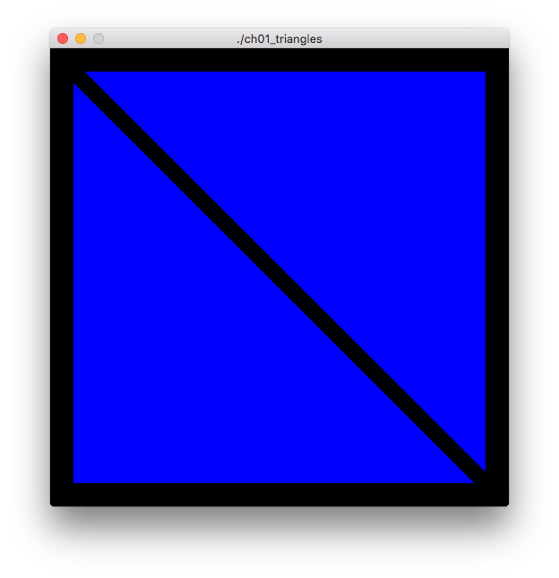

Triangles
=========

Renders two blue triangles in the window.

Notes
-----

None

Screenshot
----------

Original Source
---------------

[OpenGL Programming Guide,  Eighth Edition](http://www.amazon.com/OpenGL-Programming-Guide-Official-Learning/dp/0321773039/)

* Example 1.1 triangles.cpp: Our First OpenGL Program, p. 5
* Example 1.2 Vertex Shader for triangles.cpp: triangles.vert, p. 23
* Example 1.3 Fragment Shader for triangles.cpp: triangles.frag, p. 25
