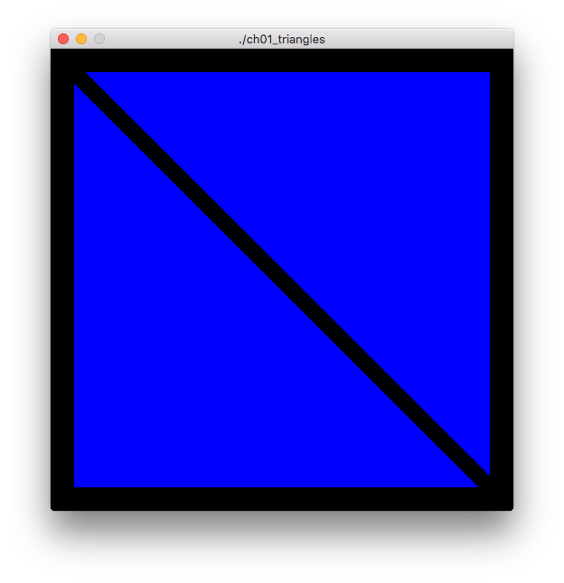

Triangles
=========

Render two blue triangles in the window.

Notes
-----

#### Significant renamed vars
* program => scene.Programs[trianglesProgID]
* Triangles => trianglesName
* ArrayBuffer => arrayBufferName
* vPosition => mcVertexLoc

#### OpenGL funcs of interest

* ```gl.BindBuffer(target uint32, buffer uint32)```
[details](https://www.opengl.org/sdk/docs/man/html/glBindBuffer.xhtml)
* ```gl.BindVertexArray(array uint32)```
[details](https://www.opengl.org/sdk/docs/man/html/glBindVertexArray.xhtml)
* ```gl.BufferData(target uint32, size int, data unsafe.Pointer, usage uint32)```
[details](https://www.opengl.org/sdk/docs/man/html/glBufferData.xhtml)
* ```gl.Clear(mask uint32)```
[details](https://www.opengl.org/sdk/docs/man/html/glClear.xhtml)
* ```gl.DrawArrays(mode uint32, first int32, count int32)```
[details](https://www.opengl.org/sdk/docs/man/html/glDrawArrays.xhtml)
* ```gl.EnableVertexAttribArray(index uint32)```
[details](https://www.opengl.org/sdk/docs/man/html/glEnableVertexAttribArray.xhtml)
* ```gl.Flush()```
[details](https://www.opengl.org/sdk/docs/man/html/glFlush.xhtml)
* ```gl.GenBuffers(n int32, buffers *uint32)```
[details](https://www.opengl.org/sdk/docs/man/html/glGenBuffers.xhtml)
* ```gl.GenVertexArrays(n int32, arrays *uint32)```
[details](https://www.opengl.org/sdk/docs/man/html/glGenVertexArrays.xhtml)
* ```gl.UseProgram(program uint32)```
[details](https://www.opengl.org/sdk/docs/man/html/glUseProgram.xhtml)
* ```gl.VertexAttribPointer(index uint32, size int32, xtype uint32, normalized bool, stride int32, pointer unsafe.Pointer)```
[details](https://www.opengl.org/sdk/docs/man/html/glVertexAttribPointer.xhtml)

Screenshot
----------



Original Source
---------------

[OpenGL Programming Guide,  Eighth Edition](http://www.amazon.com/OpenGL-Programming-Guide-Official-Learning/dp/0321773039/)

* Example 1.1 triangles.cpp: Our First OpenGL Program, p. 5
* Example 1.2 Vertex Shader for triangles.cpp: triangles.vert, p. 23
* Example 1.3 Fragment Shader for triangles.cpp: triangles.frag, p. 25
