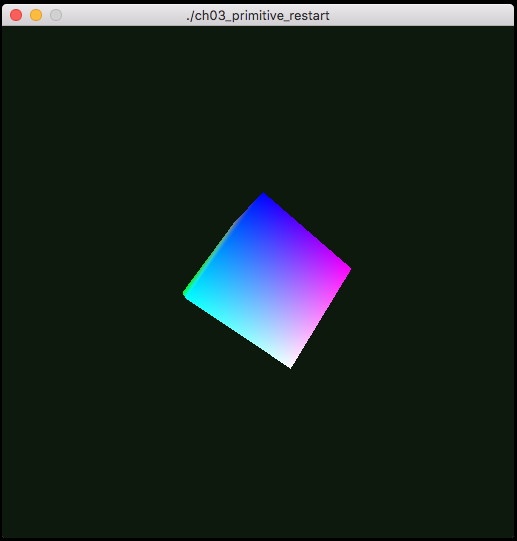

Primitive Restart
=================

NOTE: This example has been modified to allow toggling between two modes.  Additionally the background color has been modified to indicate which mode is currently running.  Green represents primitive restart mode, while blue represents the alternate rendering method.

  * Example 3.7, p. 125
  * Example 3.8, p. 127

  
