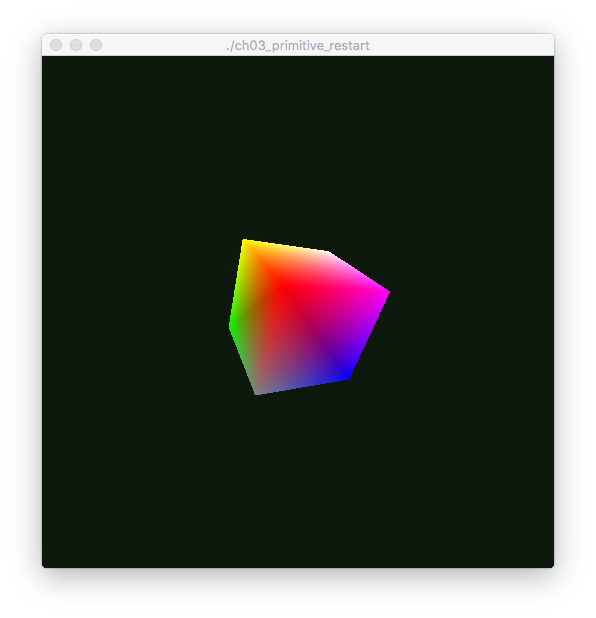

Primitive Restart
=================

Demonstrates draw commands by rendering four multi-color triangles in the window.

Notes
-----

* The original example had a macro defining "USE_PRIMITIVE_RESTART" that allowed
the draw mode to be set at compile time.  This has been modified to allow the
user to switch it at run time by pressing the space bar.  Since there is no visual
difference between the two modes, the background color has been changed to
reflect the current rendering mode.  Green represents primitive restart mode,
while blue represents the alternate rendering method requiring two separate draw
commands.

Screenshot
----------

Original Source
---------------

[OpenGL Programming Guide,  Eighth Edition](http://www.amazon.com/OpenGL-Programming-Guide-Official-Learning/dp/0321773039/)

* Example 3.7 Initializing Data for a Cube Made of Two Triangle Strips, p. 125
* Example 3.8 Drawing a Cube Made of Two Triangle Strips Using Primitive Restart, p. 127
