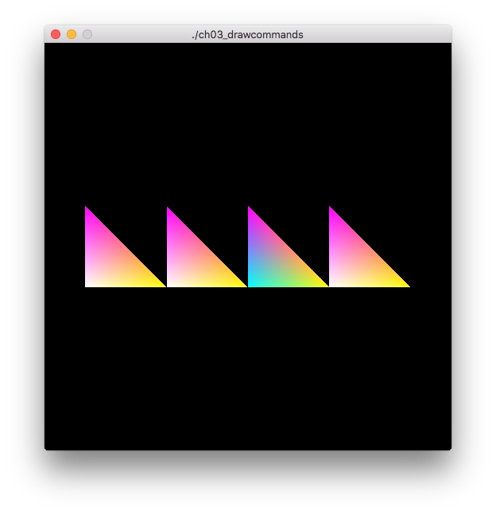

Draw Commands
=============

Demonstrates draw commands by rendering four multi-color triangles in the window.

Notes
-----

None

Screenshot
----------

Original Source
---------------

[OpenGL Programming Guide,  Eighth Edition](http://www.amazon.com/OpenGL-Programming-Guide-Official-Learning/dp/0321773039/)

* Example 3.5 Setting up for the Drawing Command Example, p. 122
* Example 3.6 Drawing Commands Example, p. 123
